# Themes

```sh
npm i @mdx-deck/themes
```

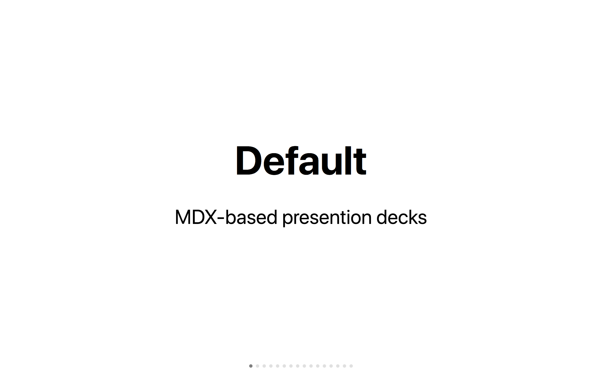

---


```js
import { big } from '@mdx-deck/themes'
```

---

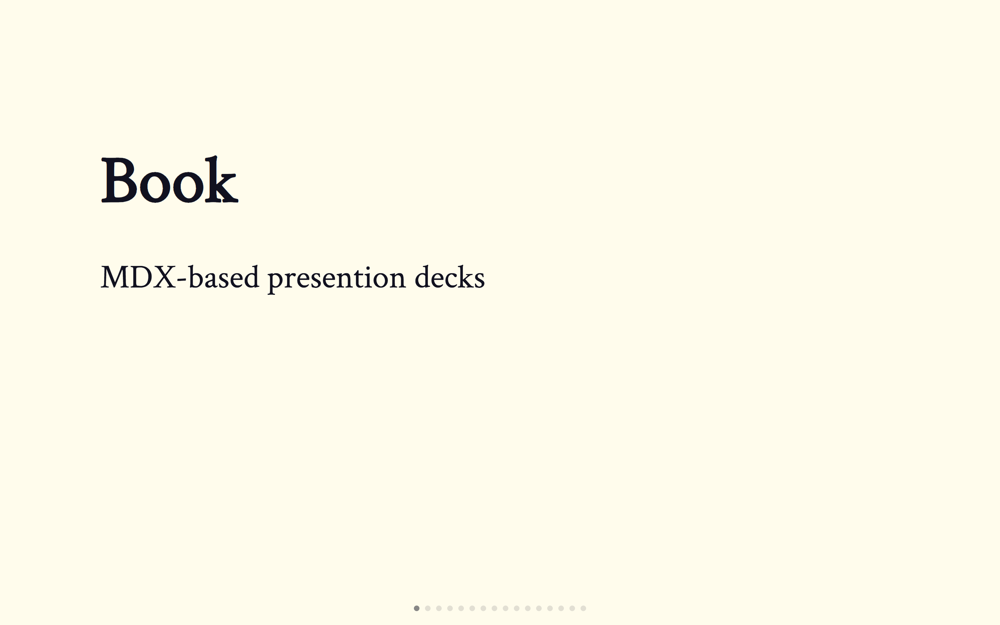

```js
import { book } from '@mdx-deck/themes'
```

---

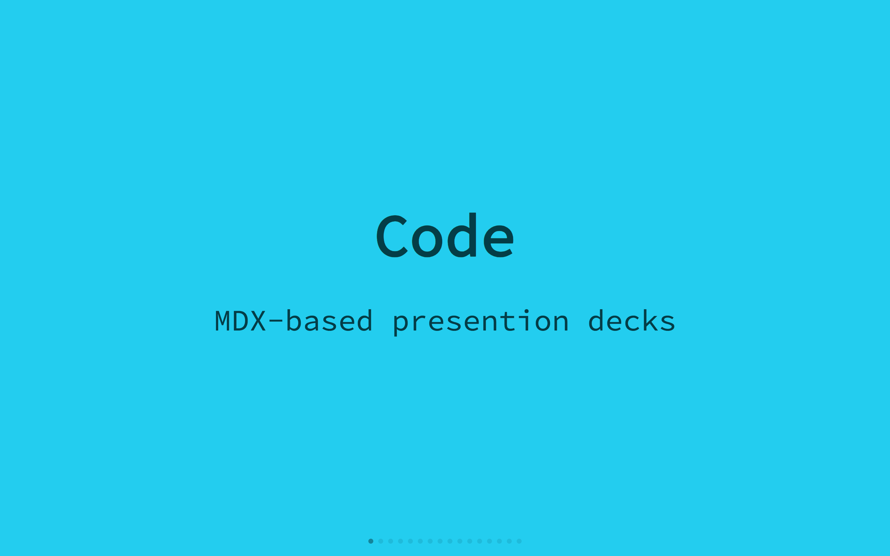

```js
import { code } from '@mdx-deck/themes'
```

---

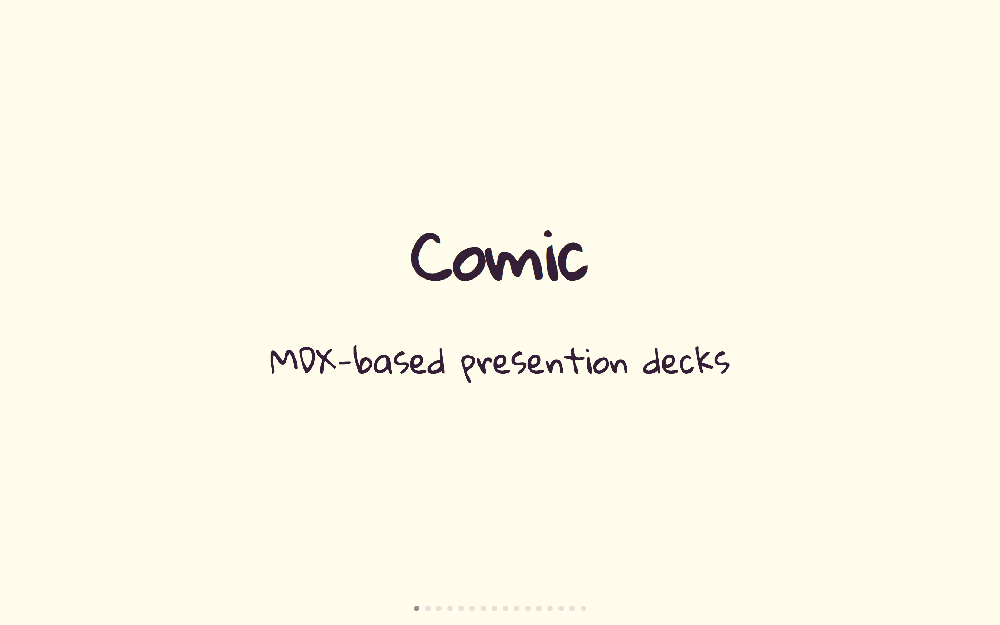

```js
import { comic } from '@mdx-deck/themes'
```

---

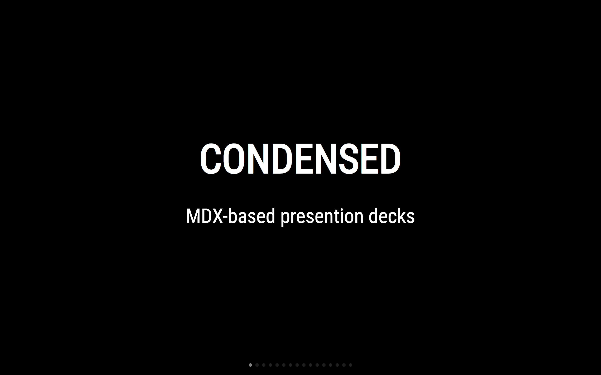

```js
import { condensed } from '@mdx-deck/themes'
```

---

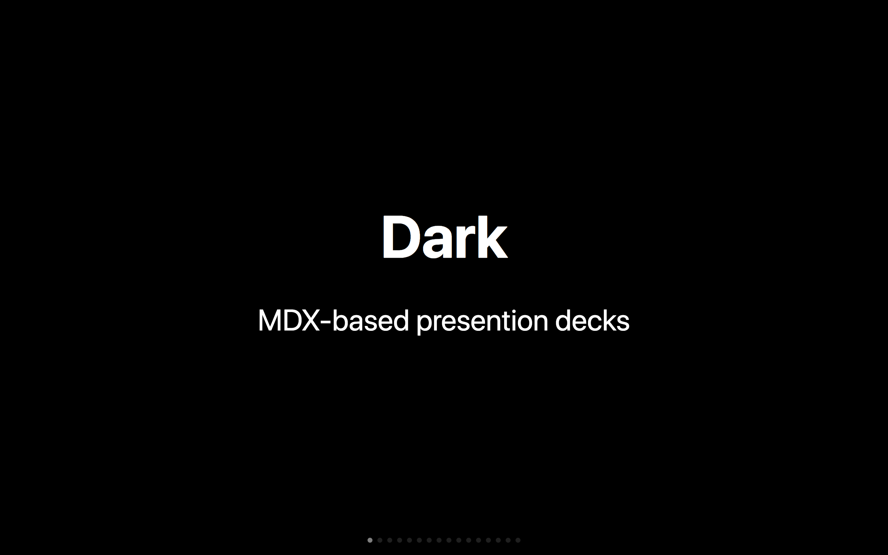

```js
import { dark } from '@mdx-deck/themes'
```

---

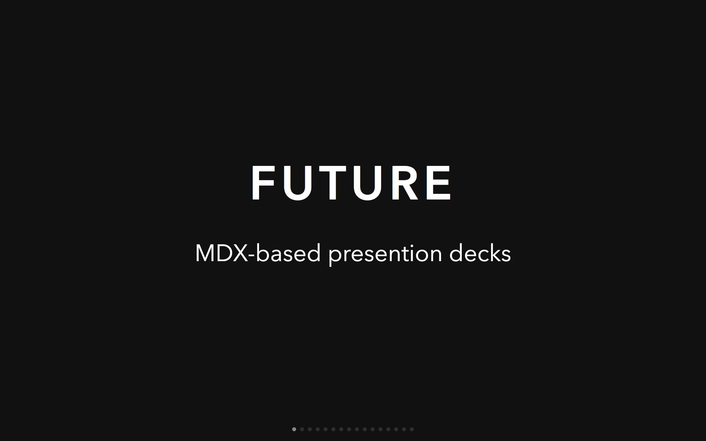

```js
import { future } from '@mdx-deck/themes'
```

---

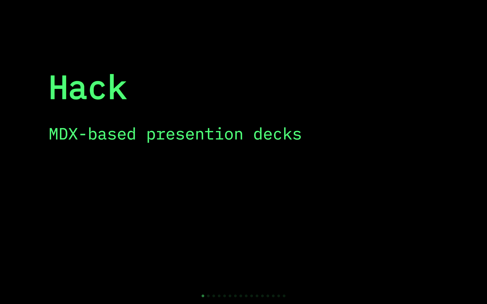

```js
import { hack } from '@mdx-deck/themes'
```

---

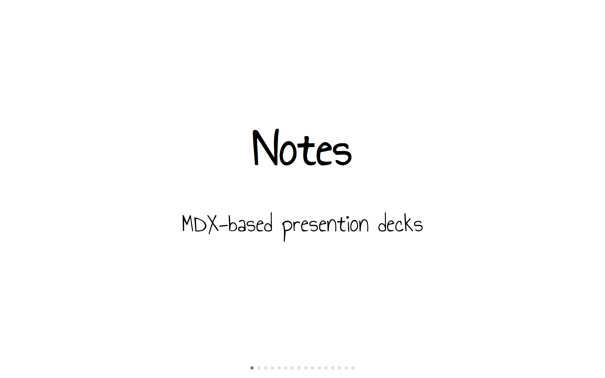

```js
import { notes } from '@mdx-deck/themes'
```

---

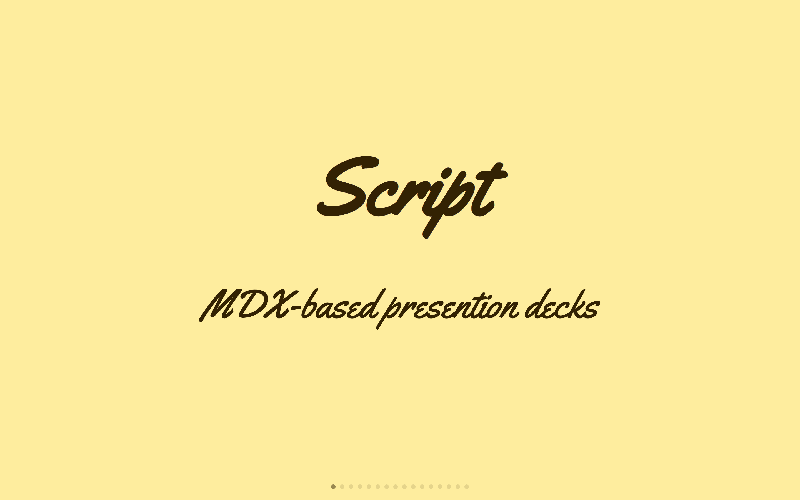

```js
import { script } from '@mdx-deck/themes'
```

---

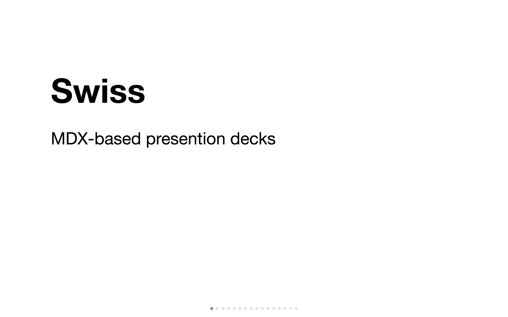

```js
import { swiss } from '@mdx-deck/themes'
```

---

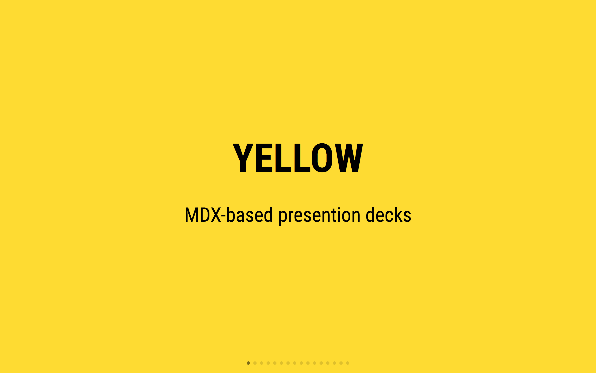

```js
import { yellow } from '@mdx-deck/themes'
```

---

Poppins

```js
import { poppins } from '@mdx-deck/themes'
```

---

Syntax Highlighting

```js
import { highlight } from '@mdx-deck/themes'
import { prism } from '@mdx-deck/themes'
```

