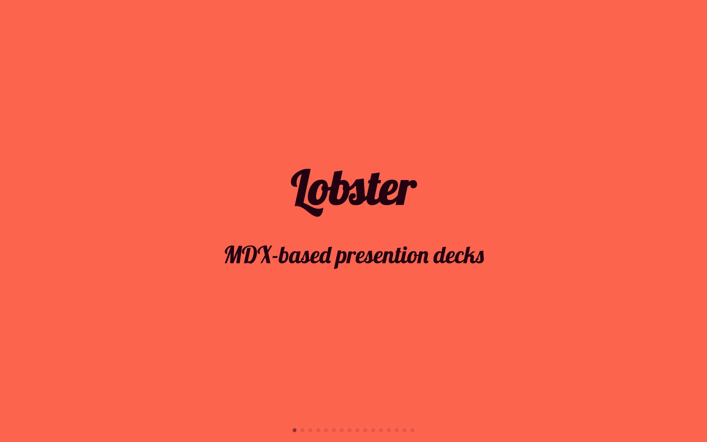
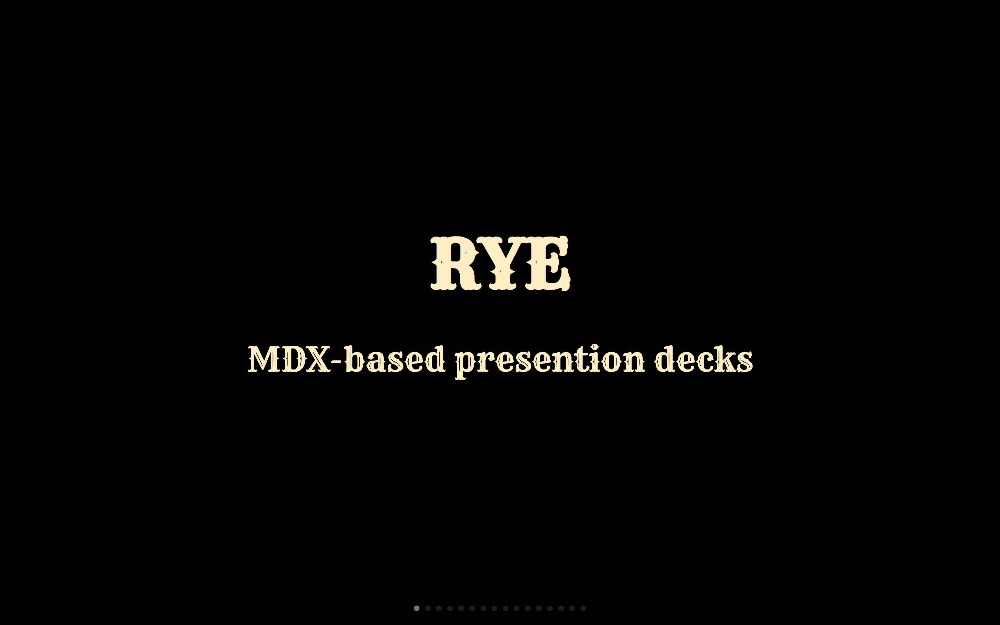

# Themes


Default

```js
export { default as theme } from '@mdx-deck/themes'
```

---


Big

```js
export { big as theme } from '@mdx-deck/themes'
```

---


Book

```js
export { book as theme } from '@mdx-deck/themes'
```

---


Code

```js
export { code as theme } from '@mdx-deck/themes'
```

---


Comic

```js
export { comic as theme } from '@mdx-deck/themes'
```

---


Condensed

```js
export { condensed as theme } from '@mdx-deck/themes'
```

---


Dark

```js
export { dark as theme } from '@mdx-deck/themes'
```

---


Future

```js
export { future as theme } from '@mdx-deck/themes'
```

---


Hack

```js
export { hack as theme } from '@mdx-deck/themes'
```

---

<!--

Lobster
-->


Notes

```js
export { notes as theme } from '@mdx-deck/themes'
```

---

<!--

Rye
-->


Script

```js
export { script as theme } from '@mdx-deck/themes'
```

---


Swiss

```js
export { swiss as theme } from '@mdx-deck/themes'
```

---


Yellow

```js
export { yellow as theme } from '@mdx-deck/themes'
```

---

Poppins

```js
export { poppins as theme } from '@mdx-deck/themes'
```

---

Syntax Highlighter

```js
export { syntaxHighlighter as theme } from '@mdx-deck/themes'
```

---

Syntax Highlighter Prism

```js
export { syntaxHighlighterPrism as theme } from '@mdx-deck/themes'
```

---

Aspect 16:9

```js
export { aspect as theme } from '@mdx-deck/themes'
```

---

Aspect 4:3

```js
export { aspect43 as theme } from '@mdx-deck/themes'
```
